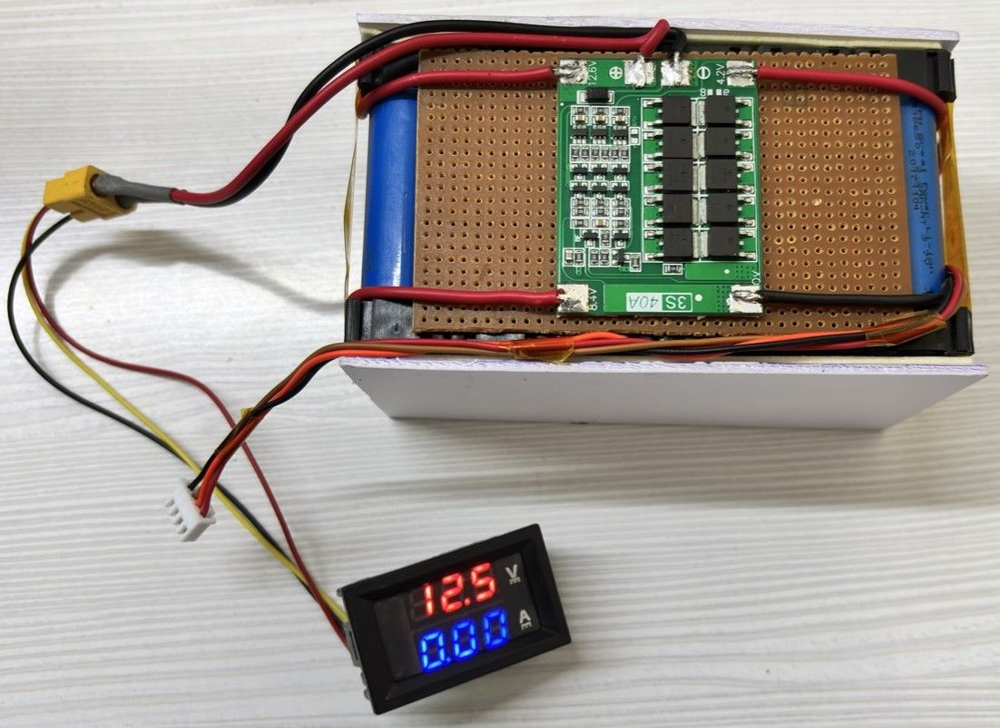
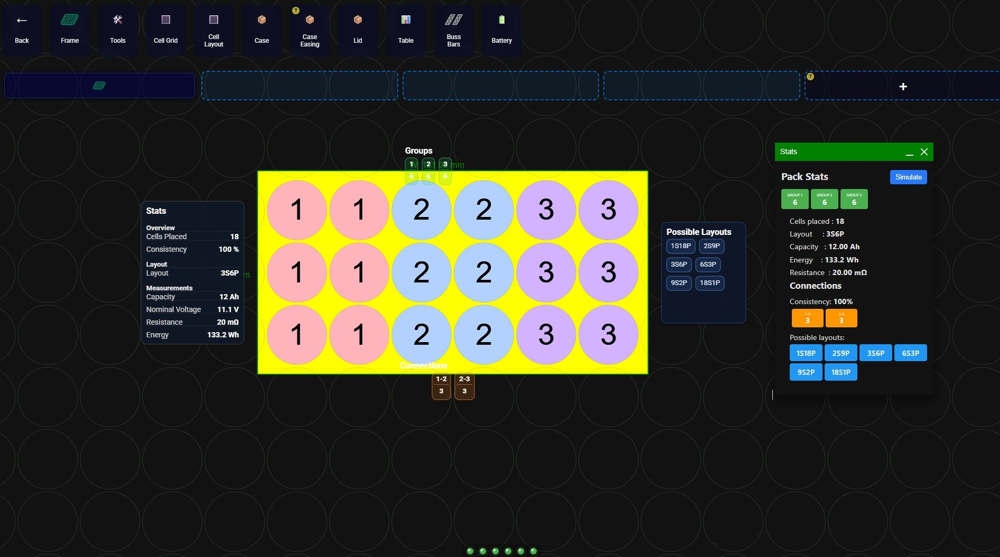
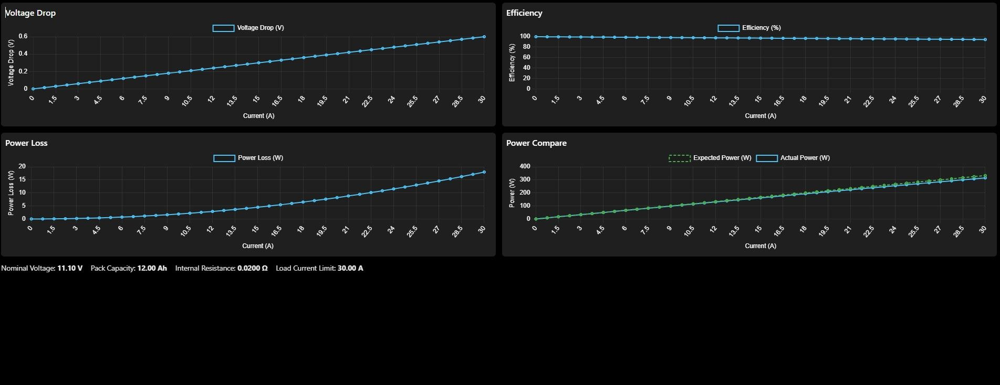

# 🔋 3S6P Li-Ion Battery Pack Design

**Design • Simulation • Hardware Implementation • Validation**

A hardware-focused battery development project covering the design,
electrical analysis, simulation, assembly, BMS integration, and
validation of an **18-cell 3S6P lithium-ion battery pack**.

<figure>

<figcaption aria-hidden="true">3S6P Battery Pack</figcaption>
</figure>

------------------------------------------------------------------------

## 📌 Project Overview

This project demonstrates the complete engineering workflow used to
develop a compact lithium-ion battery pack:

**Cell Configuration → Electrical Calculations → Simulation → BMS
Integration → Hardware Assembly → Testing & Validation**

The battery pack uses **18 × 18650 Li-ion cells** arranged as **3 series
groups × 6 parallel cells (3S6P)**.

Each 6-cell parallel group provides approximately **3.7 V / 12 Ah**.
Three such groups connected in series provide an **11.1 V nominal, 12 Ah
battery pack**.

------------------------------------------------------------------------

## 🔋 Battery Specifications

| Parameter                   | Specification |
|-----------------------------|--------------:|
| Cell Type                   |  18650 Li-ion |
| Cell Nominal Voltage        |         3.7 V |
| Cell Capacity               |      2000 mAh |
| Configuration               |      **3S6P** |
| Total Cells                 |            18 |
| Nominal Pack Voltage        |    **11.1 V** |
| Maximum Pack Voltage        |    **12.6 V** |
| Pack Capacity               |     **12 Ah** |
| Nominal Energy              |  **133.2 Wh** |
| Modeled Internal Resistance |     **20 mΩ** |
| BMS                         |   **3S 40 A** |
| Analyzed Load Current       |    **0–30 A** |

------------------------------------------------------------------------

## 🔧 3S6P Configuration

<figure>

<figcaption aria-hidden="true">3S6P Configuration</figcaption>
</figure>

### Configuration principle

- **6 cells in parallel = 3.7 V, 12 Ah**
- **3 parallel groups in series = 11.1 V, 12 Ah**
- Total cells = **3 × 6 = 18**
- Nominal energy = **11.1 × 12 = 133.2 Wh**

The series connection is made **between the parallel groups**, not by
making all 18 positive terminals common or all 18 negative terminals
common.

------------------------------------------------------------------------

## 🧮 Electrical Design

### Nominal Voltage

``` text
Vnom = 3 × 3.7
     = 11.1 V
```

### Maximum Voltage

``` text
Vmax = 3 × 4.2
     = 12.6 V
```

### Pack Capacity

``` text
Cpack = 6 × 2 Ah
      = 12 Ah
```

### Nominal Energy

``` text
E = V × C
  = 11.1 × 12
  = 133.2 Wh
```

### Internal Resistance Model

The project uses a simplified **20 mΩ pack resistance model** for the
electrical performance calculations.

At 30 A:

``` text
Voltage Drop = I × R
             = 30 × 0.020
             = 0.60 V
```

``` text
Power Loss = I² × R
           = 30² × 0.020
           = 18 W
```

The modeled loaded voltage is:

``` text
Vload = 11.1 − 0.60
      = 10.5 V
```

Modeled load power:

``` text
Pload = 10.5 × 30
      = 315 W
```

Modeled efficiency:

``` text
η = 315 / 333 × 100
  ≈ 94.6%
```

> **Note:** These 30 A values are electrical model/calculation results
> based on the 20 mΩ assumed pack resistance. They should not be
> interpreted as measured continuous-current performance.

------------------------------------------------------------------------

## 📊 Simulation & Performance Analysis

The pack was analyzed across a **0–30 A current range** for:

- Voltage drop
- I²R power loss
- Efficiency
- Expected vs. actual power
- Load-dependent electrical behavior

<figure>

<figcaption aria-hidden="true">Simulation Results</figcaption>
</figure>

### At 30 A

| Parameter          |    Result |
|--------------------|----------:|
| Nominal Voltage    |    11.1 V |
| Modeled Resistance |     20 mΩ |
| Voltage Drop       |  ≈ 0.60 V |
| Loaded Voltage     | ≈ 10.50 V |
| Nominal Power      |     333 W |
| Modeled Load Power |   ≈ 315 W |
| Power Loss         |    ≈ 18 W |
| Modeled Efficiency |   ≈ 94.6% |

------------------------------------------------------------------------

## 🛠️ Hardware Implementation

The physical battery pack was assembled using:

- 18 × 18650 Li-ion cells
- 3S6P configuration
- 3S 40 A BMS
- XT60 main power connector
- 4-pin balance connector
- DC voltage/current panel meter
- Cell interconnects
- Electrical insulation
- Custom mechanical enclosure/frame

<figure>

<figcaption aria-hidden="true">Battery Pack Top View</figcaption>
</figure>

### BMS Protection

The integrated BMS provides protection functions including:

- Overcharge protection
- Over-discharge protection
- Over-current protection
- Short-circuit protection
- Passive cell balancing

------------------------------------------------------------------------

## 🔌 Hardware Architecture

``` text
                3S6P Battery Pack

       6P Group 1      6P Group 2      6P Group 3
       3.7 V / 12 Ah   3.7 V / 12 Ah   3.7 V / 12 Ah
            │                │                │
            └──── Series ────┴──── Series ───┘

                    11.1 V / 12 Ah
                           │
                       3S BMS
                           │
                     XT60 Output
```

The BMS monitors the three series-group nodes and provides protection
and balancing.

------------------------------------------------------------------------

## 🧪 Test & Validation

The assembled pack was visually inspected and electrically observed.

### Hardware observations

| Parameter            | Observed / Validated Result |
|----------------------|----------------------------:|
| Configuration        |                        3S6P |
| Total Cells          |                          18 |
| BMS                  |                     3S 40 A |
| Main Connector       |                        XT60 |
| Balance Connector    |                       4-pin |
| No-load Pack Voltage |                    ≈ 12.5 V |
| No-load Current      |                      0.00 A |

The approximately **12.5 V / 0.00 A** reading was observed on the
integrated panel meter in the provided hardware photograph.

<figure>

<figcaption aria-hidden="true">Battery Pack</figcaption>
</figure>

### Calculated performance

The 20 mΩ electrical model gives:

- ≈0.60 V voltage drop at 30 A
- ≈18 W I²R loss at 30 A
- ≈10.5 V modeled loaded voltage
- ≈315 W modeled load power
- ≈94.6% modeled efficiency

For detailed calculations and validation methodology, see the project
documents.

------------------------------------------------------------------------

## 📁 Repository Structure

``` text
3S6P-Li-Ion-Battery-Pack-Design/
│
├── README.md
│
├── images/
│   ├── 3S6P_configuration.png
│   ├── battery_pack.jpg
│   ├── battery_pack_top.jpg
│   └── simulation_results.jpg
│   └── BMS_Cell_Connection_Diagram.jpg
|   └── 4S-40A-BMS-Module.jpg
|
├── docs/
│   ├── Battery_Pack_Design.pdf
│   ├── Design_Calculations.pdf
│   ├── Test_Report.pdf
│   └── Safety_Notes.md
│
├── BOM.xlsx
│
└── LICENSE
```

------------------------------------------------------------------------

## 📄 Documentation

| Document                                            | Description                                              |
|-----------------------------------------------------|----------------------------------------------------------|
| [Battery Pack Design](Docs/Battery_Pack_Design.pdf) | Complete project design and implementation report        |
| [Design Calculations](Docs/Design_Calculations.pdf) | Electrical calculations and performance model            |
| [Test Report](Docs/Test_Report.pdf)                 | Hardware observations and validation results             |
| [Safety Notes](Docs/Safety_Notes.md)                | Battery handling, charging, testing, and safety guidance |
| [BOM](BOM.xlsx)                                     | Hardware bill of materials                               |

------------------------------------------------------------------------

## 📦 Bill of Materials

The major hardware components include:

| Category   | Component                | Quantity |
|------------|--------------------------|---------:|
| Cells      | 18650 Li-ion, 2000 mAh   |       18 |
| Protection | 3S 40 A BMS              |        1 |
| Power      | XT60 connector           |        1 |
| Monitoring | DC voltage/current meter |        1 |
| Balance    | 4-pin balance connector  |        1 |
| Mechanical | Cell holder / enclosure  |    1 set |
| Insulation | Fish paper / Kapton tape |    1 set |
| Wiring     | Main and balance wiring  |    1 set |

See [BOM.xlsx](BOM.xlsx) for the detailed bill of materials.

------------------------------------------------------------------------

## 🎯 Engineering Skills Demonstrated

This project demonstrates practical experience in:

- Lithium-ion battery pack design
- Series/parallel cell configuration
- Electrical calculations
- Internal resistance modeling
- Voltage sag analysis
- I²R power-loss estimation
- Efficiency analysis
- BMS integration
- Battery protection systems
- Hardware assembly
- Electrical testing
- Engineering documentation
- Hardware validation

------------------------------------------------------------------------

## 🚀 Future Improvements

Potential next steps include:

- Individual series-group voltage monitoring
- Temperature sensing
- Coulomb counting
- SOC estimation
- SOH estimation
- CAN-based BMS communication
- Battery data logging
- Real-time battery monitoring dashboard
- Electronic-load characterization
- Thermal characterization
- Dedicated PCB-based BMS
- Improved mechanical and thermal enclosure

------------------------------------------------------------------------

## ⚠️ Safety

Lithium-ion batteries contain significant stored energy and can present
fire, thermal, and electrical hazards.

Always:

- Use properly matched and undamaged cells.
- Follow the cell manufacturer’s specifications.
- Use a correctly rated BMS.
- Use a charger designed for a 3S Li-ion pack with a 12.6 V charge
  limit.
- Prevent accidental short circuits.
- Use appropriately rated wiring and connectors.
- Provide adequate electrical insulation.
- Monitor temperature during high-current operation.
- Never intentionally short-circuit the battery.

See [Safety_Notes.md](Docs/Safety_Notes.md) for detailed project safety
guidance.

------------------------------------------------------------------------

## 👨‍💻 Author

**Amey Chougule**

Electronics & Communication Engineer  
Embedded Systems \| Automotive Electronics \| Hardware Design \| PCB
Design \| Battery Systems

------------------------------------------------------------------------

## 📜 License

This project is provided for educational, engineering, and portfolio
documentation purposes.
